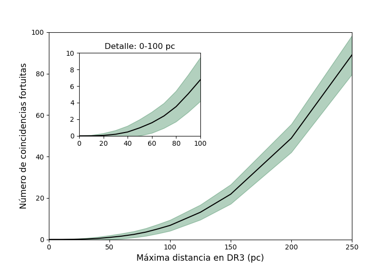

# False Positive Estimation for Crossmatch Between Catalogs Using HPC

This project aims to estimate the number of false positives when performing crossmatching between catalogs (e.g., Gaia DR3 and FIRST) using a simulated environment. The goal is to determine how many false matches can be expected at different distances, without calculating probabilities, but focusing on the number of objects present up to a given distance.

## About this project

In this work, we simulate random positions of stars and radio sources within 10,000 square degrees of area, and perform crossmatching to estimate the number of false positives. The analysis includes multiple distance intervals to understand how the number of false positives increases with distance. The main objective is to better understand how far out we can expect false positives when using crossmatching techniques.

## Methodology

1. **Simulation Setup**:
   - Random star and radio source positions are generated within predefined, irregular observation areas (e.g., 10 pc, 20 pc, etc.).
   - The crossmatching process is performed to estimate the number of false matches at different distances, with the ultimate aim of calculating false positives in each interval.

2. **Using HPC**:
   - High-Performance Computing (HPC) was utilized to run a large number of simulations efficiently.
   - A total of 1000 simulations were executed to obtain a robust estimate of false positives.

## Results

The analysis presents a graph illustrating the mean and standard deviation of the false positives obtained at each distance interval. The graph emphasizes simulations up to 100 pc, where up to 10 false matches (out of 34 obtained) are expected. For distances up to 250 pc, up to 100 false positives (out of 202 obtained in the crossmatch) can be expected.

**Figure 1**: Number of expected false coincidences as a function of search distance for catalog-based crossmatching methods.
